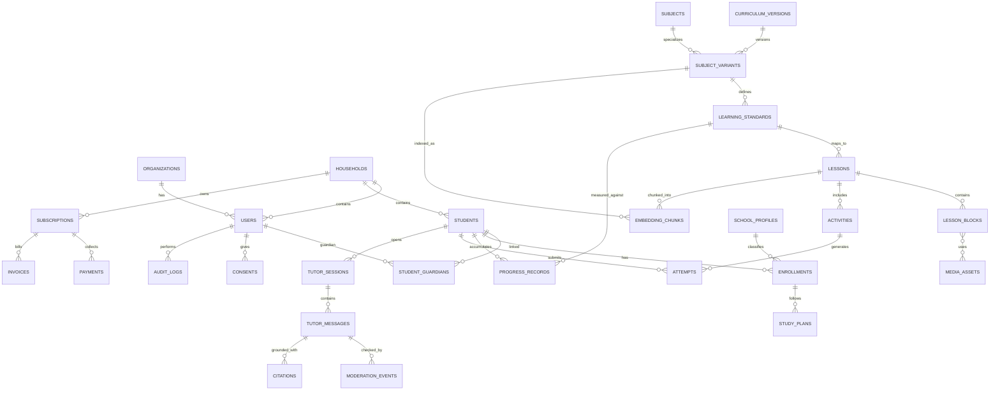
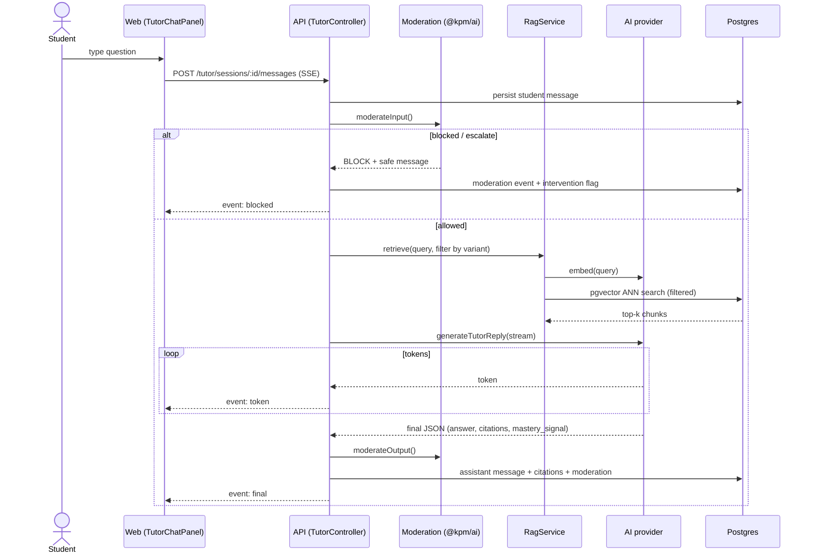

# Architecture

## Overview

A TypeScript monorepo (pnpm + Turborepo) with three deployable apps and five
shared packages.

- **apps/web** — Next.js App Router frontend (parent / student / admin portals).
- **apps/api** — NestJS + Fastify REST API; Prisma over PostgreSQL; SSE for tutor.
- **apps/worker** — BullMQ workers (embeddings, moderation escalation, reports).
- **packages/types** — enums + Zod DTOs + AI contracts (shared by web & api).
- **packages/config** — validated env loader + feature flags.
- **packages/ai** — provider-agnostic AI layer (Anthropic / OpenAI / Azure / mock).
- **packages/ui** — shared React primitives.
- **packages/curriculum** — curriculum helpers (reserved for import tooling).
- **packages/observability** — `initTracing(serviceName)`: OpenTelemetry NodeSDK +
  OTLP exporter + auto-instrumentations. Called first in the api/worker bootstrap;
  no-op unless `OTEL_EXPORTER_OTLP_ENDPOINT` is set. Exports to any OTLP collector
  or the Azure Monitor exporter.

Postgres is the system of record; pgvector holds embeddings beside relational
data. Redis backs sessions, caching, and the BullMQ queues. Object storage is
S3-compatible (MinIO in dev, Azure Blob in prod).

## Core modeling decisions

1. A child belongs to a household and may also hold an independent login.
2. Curriculum is **versioned** and modeled as `SubjectVariant` keyed by
   `(subject, curriculum version, level, school_type, language, dlp_mode)` —
   never a single translated syllabus tree.
3. Progress is stored against **learning standards + evidence** (`ProgressRecord`
   with a PBD-style `currentTahapPenguasaan`), not just lesson completion.
4. AI conversations are educational records: moderated, cited, retention-controlled.
5. Billing belongs to the household/organization, never a child identity.

## ER diagram

See [apps/api/prisma/schema.prisma](../apps/api/prisma/schema.prisma) for the
full field-level definition.

## AI tutor request flow

## Performance-sensitive indexes

Declared in `schema.prisma` (`@@index`) and the SQL migrations:

- `EmbeddingChunk (curriculumVersionCode, schoolType, language, dlpMode)` + IVFFlat ANN.
- `Attempt (studentId, submittedAt DESC)`.
- `TutorMessage (tutorSessionId, createdAt)`.
- Partial index on `ModerationEvent` where `policyResult <> 'PASS'`.
